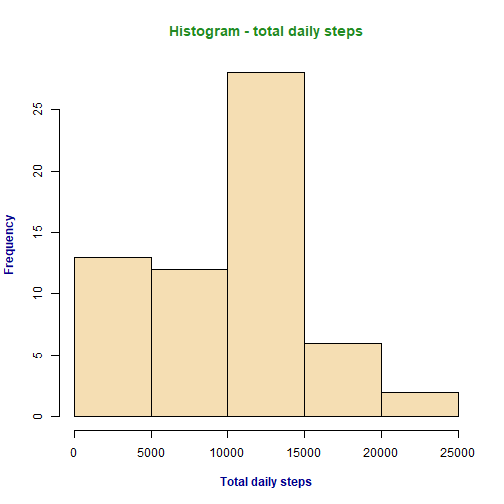
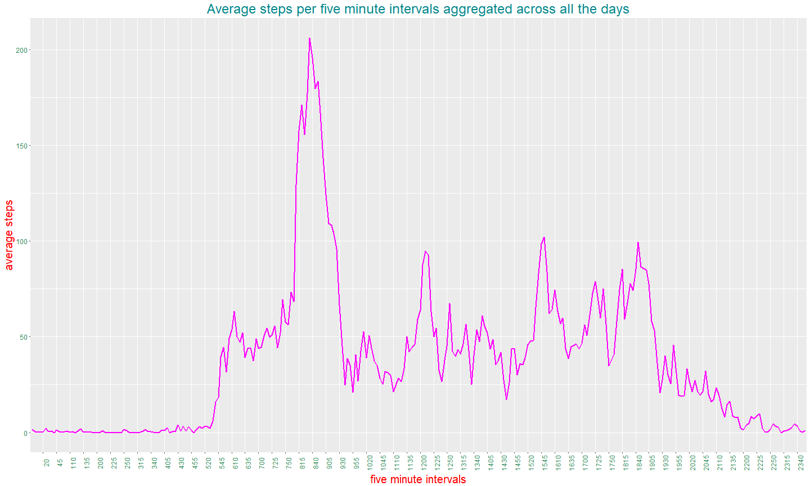
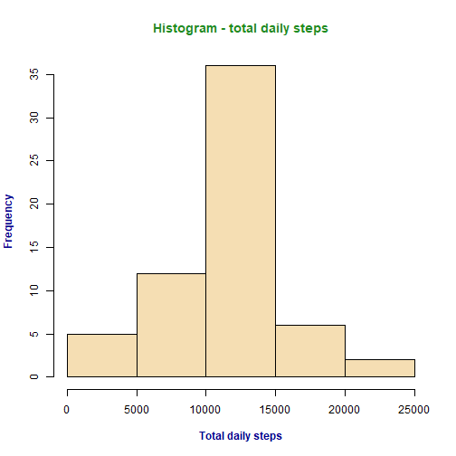
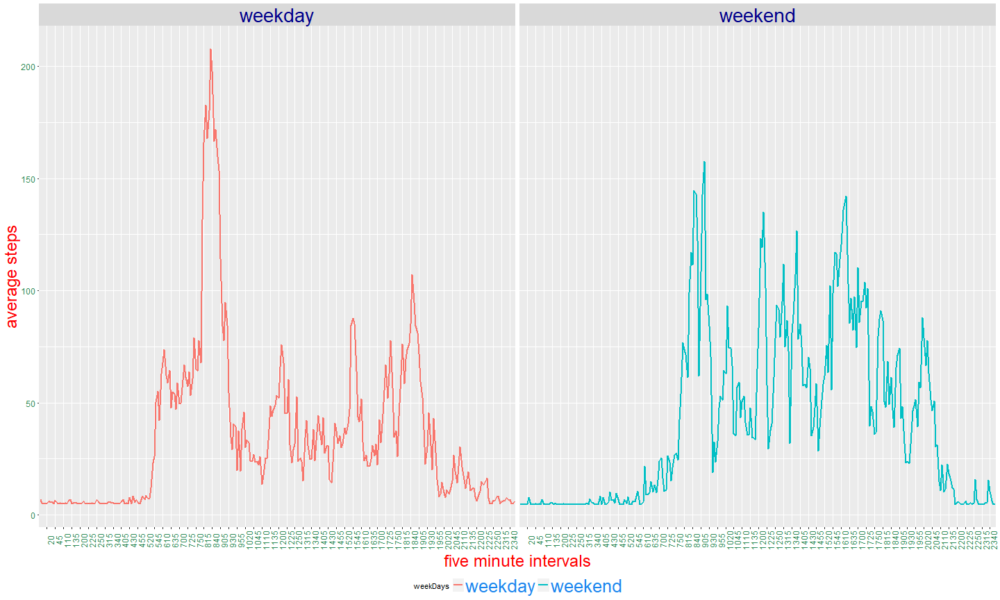

                                         #### Assignment Description ####
**Introduction**

This assignment makes use of data from a personal activity monitoring device. This device collects data at 5 minute intervals through out the day. The data consists of two months of data from an anonymous individual collected during the months of October and November, 2012 and include the number of steps taken in 5 minute intervals each day.

The variables included in the dataset for the assignment are:

*steps:* Number of steps taking in a 5-minute interval (missing values are coded as NA).

*date:* The date on which the measurement was taken in YYYY-MM-DD format.

*interval:* Identifier for the 5-minute interval in which measurement was taken.
The dataset is stored in a comma-separated-value (CSV) file and there are a total of 17,568 observations in this dataset.


**What is mean total number of steps taken per day?**

For this part of the assignment, you can ignore the missing values in the dataset.

1. Calculate the total number of steps taken per day.
2. If you do not understand the difference between a histogram and a barplot, research the difference between them. Make a histogram of the total number of steps taken each day.
3. Calculate and report the mean and median of the total number of steps taken per day

**What is the average daily activity pattern?**

Make a time series plot (i.e. type = "l") of the 5-minute interval (x-axis) and the average number of steps taken, averaged across all days (y-axis) Which 5-minute interval, on average across all the days in the dataset, contains the maximum number of steps?

**Imputing missing values**

Note that there are a number of days/intervals where there are missing values (coded as NA). The presence of missing days may introduce bias into some calculations or summaries of the data.

1. Calculate and report the total number of missing values in the dataset (i.e. the total number of rows with NAs)
2. Devise a strategy for filling in all of the missing values in the dataset. The strategy does not need to be sophisticated. For example, you could use the mean/median for that day, or the mean for that 5-minute interval, etc.
3. Create a new dataset that is equal to the original dataset but with the missing data filled in.
4. Make a histogram of the total number of steps taken each day and calculate and report the mean and median total number of steps taken per day. Do these values differ from the estimates from the first part of the assignment? What is the impact of imputing missing data on the estimates of the total daily number of steps?

**Are there differences in activity patterns between weekdays and weekends?**

For this part the weekdays() function may be of some help here. Use the dataset with the filled-in missing values for this part.

1. Create a new factor variable in the dataset with two levels - "weekday" and "weekend" indicating whether a given date is a weekday or weekend day.
2. Make a panel plot containing a time series plot (i.e. type = "l") of the 5-minute interval (x-axis) and the average number of steps taken, averaged across all weekday days or weekend days (y-axis). See the README file in the GitHub repository to see an example of what this plot should look like using simulated data. 

                                        #### Solutions ####
                                        
**Total number of stepes taken per day - ignoring 'NA' values:**

```r
activ <- read.csv("activity.csv")
tot <- aggregate(steps~date, activ, sum, na.action=na.pass, na.rm=TRUE)
head(tot) ## The first few lines of the daily total steps
```

```
##         date steps
## 1 2012-10-01     0
## 2 2012-10-02   126
## 3 2012-10-03 11352
## 4 2012-10-04 12116
## 5 2012-10-05 13294
## 6 2012-10-06 15420
```

```r
hist(tot$steps, col="wheat", main="Histogram - total daily steps", xlab="Total daily steps", ylab="Frequency", font.lab=2, col.lab="darkblue", col.main="forestgreen")
```



**Total mean and median of the number of stepes taken per day - ignoring 'NA' values:**


```r
mean(tot$steps) ## Mean of the total number of daily steps
```

```
## [1] 9354.23
```

```r
median(tot$steps) ## Median of the total number of daily steps
```

```
## [1] 10395
```

**The average daily activity pattern**


```r
library(ggplot2)
library(scales)
library(dplyr)

activ <- activ %>% mutate(fiveMinInt = as.factor(interval))
ave5MinInt <- aggregate(steps~fiveMinInt, activ, mean, na.action=na.pass,na.rm=TRUE)

head(ave5MinInt) ## First few lines of average steps per five min interval
```

```
##   fiveMinInt     steps
## 1          0 1.7169811
## 2          5 0.3396226
## 3         10 0.1320755
## 4         15 0.1509434
## 5         20 0.0754717
## 6         25 2.0943396
```

```r
g <- ggplot(ave5MinInt, aes(x=fiveMinInt, y=steps,group=1)) 
g <- g + geom_line(size=1, color="magenta") + ylab("average steps")
g <- g + xlab("five minute intervals")
g <- g + ggtitle("Average steps per five minute intervals aggregated across all the days")
g <- g + theme(plot.title=element_text(color="turquoise4", size= 24, hjust=0.5))
g <- g +  theme(axis.text.x=element_text(angle=90)) 
g <- g + theme(axis.title = element_text(size=20, color="red"))
g <- g + theme(axis.text=element_text(size=12, color="seagreen")) 
g <- g + scale_x_discrete(breaks =  ave5MinInt$fiveMinInt[!(as.integer(ave5MinInt$fiveMinInt) %% 5)])

print(g)
```



**Which 5-minute interval, on average across all the days in the dataset, contains the maximum number of steps?**


```r
ave5MinInt[ave5MinInt$steps==max(ave5MinInt$steps),]
```

```
##     fiveMinInt    steps
## 104        835 206.1698
```

So, the 5-minute interval that contains the maximum number of steps, on average across all the days in the data set is the 835th interval with average steps of 206.17 steps (averaged across all the days).

**Missing Values**


```r
sum(is.na(activ$steps))
```

```
## [1] 2304
```
- This shows there are 2304 rows with missing values. I would like to replace the missing (NA) values by the average of the daily average steps, which can be obtained by the following lines of code:


```r
dailyAvs <- aggregate(steps ~ date, activ, mean, na.action=na.pass, na.rm=TRUE)

head(dailyAvs) ## First few lines of the daily average steps
```

```
##         date    steps
## 1 2012-10-01      NaN
## 2 2012-10-02  0.43750
## 3 2012-10-03 39.41667
## 4 2012-10-04 42.06944
## 5 2012-10-05 46.15972
## 6 2012-10-06 53.54167
```

```r
dailyAve <- mean(dailyAvs$steps, na.rm=TRUE)

dailyAve
```

```
## [1] 37.3826
```

```r
activ$steps[is.na(activ$steps)] <- dailyAve
```
**Total number of stepes taken per day - with NA values replaced:**

```r
totNAnone <- aggregate(steps~date, activ, sum)
head(totNAnone) ## The first few lines of the daily total steps
```

```
##         date    steps
## 1 2012-10-01 10766.19
## 2 2012-10-02   126.00
## 3 2012-10-03 11352.00
## 4 2012-10-04 12116.00
## 5 2012-10-05 13294.00
## 6 2012-10-06 15420.00
```

```r
with(totNAnone, hist(steps, col="wheat", main="Histogram - total daily steps", xlab="Total daily steps", ylab="Frequency", font.lab=2, col.lab="darkblue", col.main="forestgreen"))
```



**Total mean and median of the number of stepes taken per day - with NA values replaced:**

*--calculate and report the mean and median total number of steps taken per day. Do these values differ from the estimates from the first part of the assignment? What is the impact of imputing missing data on the estimates of the total daily number of steps?*


```r
mean(totNAnone$steps) ## Mean of the total number of daily steps
```

```
## [1] 10766.19
```

```r
median(totNAnone$steps) ## Median of the total number of daily steps
```

```
## [1] 10766.19
```
*-The mean and median calculated here, after the missing values were inputted, are slightly different from the calculations with the missing values removed. I think the impact of imputing the missing data on the estimates of the total daily number of steps is that its distribution now is much closer to a normal distribution. Also, the mean and median are now equal (at least for the inputs that I made).*

**Differences in activity patterns between weekdays and weekends.**


```r
weekdayDays <- c("Monday", "Tuesday", "Wednesday", "Thursday", "Friday")
weekendDays <- c("Saturday", "Sunday")
activ$weekDays <- weekdays(as.Date(activ$date))
activ$weekDays[activ$weekDays %in% weekdayDays] <- "weekday"
activ$weekDays[activ$weekDays %in% weekendDays] <- "weekend"
activ <- transform(activ, weekDays = factor(weekDays))
ave5MinIntWKDs <- aggregate(steps~fiveMinInt + weekDays, activ, mean)
head(ave5MinIntWKDs) ## First few rows of average steps over five min intervals aggregated over weekdays and weekends separately.
```

```
##   fiveMinInt weekDays    steps
## 1          0  weekday 7.006569
## 2          5  weekday 5.384347
## 3         10  weekday 5.139902
## 4         15  weekday 5.162124
## 5         20  weekday 5.073235
## 6         25  weekday 6.295458
```

```r
g <- ggplot(ave5MinIntWKDs, aes(x=fiveMinInt, y=steps,group=1)) 
g <- g + facet_grid(.~weekDays) + aes(colour = weekDays)
g <- g + geom_line(size=1) + ylab("average steps")
g <- g + xlab("five minute intervals")
g <- g +  theme(axis.text.x=element_text(angle=90)) 
g <- g + theme(axis.title = element_text(size=24, color="red"))
g <- g + theme(axis.text=element_text(size=12, color="seagreen"))
g <- g + theme(strip.text = element_text(size = 28, color='darkblue'))
g <- g + scale_x_discrete(breaks =  ave5MinIntWKDs$fiveMinInt[!(as.integer(ave5MinIntWKDs$fiveMinInt) %% 5)])
g <- g + theme(legend.position = 'bottom', legend.text=element_text(color='dodgerblue2', size=26)) 
print(g)
```


